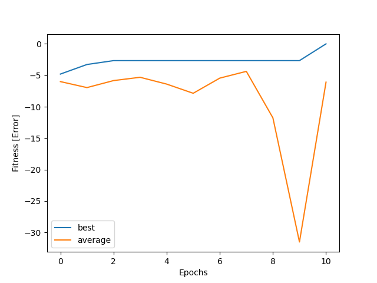

# Genetic Programming
Autor: Luis Cossio


## Description

Implementation of genetic programming for the task of finding an aproximation of a function 
and to solve the problema of des chiffres et des lettres. Contains 2 excecutabls that show the 
result of the genetic programming in their respective task.
 

## Structure
The structure of the project is:
  ```
  genetic_programming
  ├── Genetic_program.py
  ├── Individuals.py
  ├── test_individuals.py
  ├── ex_des_chiffres_et_des_lettres.py
  ├── ex_function_estimation.py
  ├── requirements.txt
  └── README.md
  ```

## Deployment
To use the executable file ex_des_chiffres_et_des_lettres.py use in the folder a command like this one:
```
python ex_des_chiffres_et_des_lettres.py --population 50 --inputs 1 2 3 4 5 6 7 8 --output 23 --mutation 0.3 --epochs 50 --end-condition 0
```
To use the executable file ex_function_estimation.py use in the folder a command like this one:
```
python ex_function_estimation.py --population 50 --inputs 1 2 3 4 5 6 7 8 --output 2 4 6 8 10 12 14 16 --mutation 0.3 --epochs 50 --end-condition 0
```

## Description of Algorithm
*   Implementation of genetic programming for calculation of expresions, for the problem known as  des chiffres et des lettres and function approximation. 
The first one consist of a estimation of a expression of the form:

12-5*4+7+2*9 = 17

Where  the inputs are [12,5,4,7,2,9] and the output is 17. The input can take any length greater than 1
and the output must be a real number. The operation avalaible are sum, rest multiplication and division. 

*   The second problem consist in function estimation. Where inputs are given in the form of an array 
input = [1,2,3,4], and the expected output will be of the form output = [2,4,6,8]. In this particular 
example the function is f(x) = 2x. This programs found an expression that estimates the function
that generated the output given the input.  

*   After the process is complete, a plot of fitness is showed across all epochs. Plotting both, 
average and best fitness per epoch. 


*   The Solution is divided between a Genetic programming module, a Population module and an individual
module. The Genetic programming module manages the record of fitness per epoch, the end condition 
(whether the process will end when a given goal is reached, like error 0, or if the process will 
iterate over N fixed epochs), and mutation rates. The population module manage a population of 
individuals, the cross-over method and other group mechanics. Individual modules are trees of 
nodes that contains the inputs and calculate the operation. 


## Results 
Example of fitness generated by the algorithm


  


## Libraries
matplotlib 


## Installation
### Install python
In order to install the programing language follow the installation instructions in the official site:

https://www.python.org/downloads/ 

### Install Pip
In case of not having an installation tool, it is recommended install pip, following the instruccions of the official site:

https://pip.pypa.io/en/stable/reference/pip_install/

### Install libraries
To install the libraries just run the next code in the commando line using pip:
```
pip install -r requirements.txt
```

## Info
Language: Python
 
Version: python 3.7